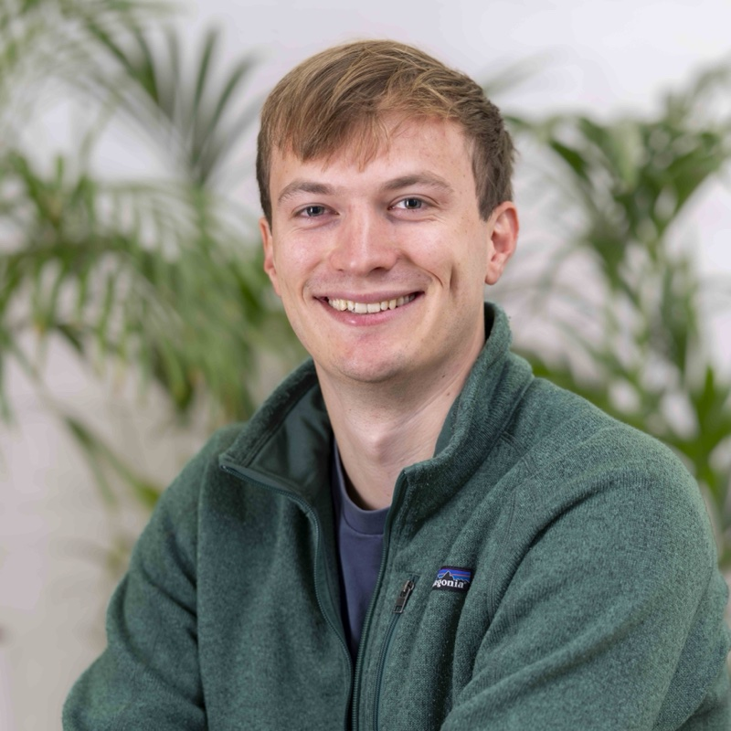
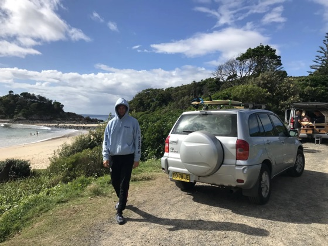
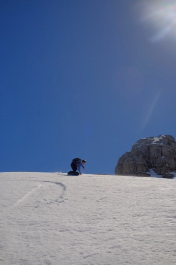
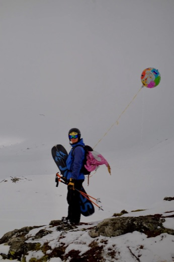

## About me {#about-me}

  

    
I am a Member of Technical Staff at <a href="https://apolloresearch.ai/">Apollo Research</a> in Zürich, where I lead the RL Dynamics project. I care about effectively making the world a better place, and therefore I work on keeping AI systems safe.

    
I am also a board member at the <a href="https://enais.co">European Network for AI Safety</a> which I co-founded, and an advisor to <a href="https://safeainetherlands.org/">Safe AI Netherlands (SAIN)</a>.

  

  

## Work experience {#work-experience}

Current

### Member of Technical Staff at Apollo Research

June 2025 – Present · Zürich / London · <a href="https://apolloresearch.ai/">apolloresearch.ai ↗</a>

I am the project lead for the RL Dynamics project, in which we study how undesired behaviors emerge during reinforcement learning. Before that, I predominantly worked on evaluating AI capabilities and propensities regarding scheming, and on AI control. I mostly work from Zürich.

### Advisor at Safe AI Netherlands (SAIN)

May 2026 – Present · Part-time · <a href="https://safeainetherlands.org/">safeainetherlands.org ↗</a>

I advise Safe AI Netherlands, an organization supporting AI safety work in the Netherlands.

### Co-founder and board member at ENAIS

Dec 2022 – Present · Remote · <a href="https://enais.co">enais.co ↗</a>

I co-founded the European Network for AI Safety (ENAIS), with a goal to improve coordination and collaboration between AI Safety researchers and policymakers in Europe. I was co-director until September 2024, and since October 2024 I serve as a board member.

Past

### Independent AI safety researcher

Jan 2025 – May 2025 · Remote

I worked on research related to <a href="https://arxiv.org/abs/2511.09904">AI sandbagging and control</a>. I examined how well monitors can catch both sandbagging and more general sabotage attempts.

### Resident at Mantic

Oct 2024 – Feb 2025 · London, UK & Remote · <a href="https://mntc.ai">mntc.ai ↗</a>

Mantic has the goal of creating an AI superforecaster. I worked as a research scientist / engineer at the startup.

### Independent research on AI sandbagging

Jul 2024 – Oct 2024 · London, UK & Remote

I continued research on strategic underperformance on evaluations (sandbagging) with a grant from the [AI Safety Fund](https://aisfund.org) from the [Frontier Model Forum](https://www.frontiermodelforum.org). Together with Francis Rhys Ward and Felix Hofstätter, I [continued the research](https://arxiv.org/abs/2502.02180) started at [MATS](https://matsprogram.org).

### Research scholar at MATS

Jan 2024 – Jul 2024 · Berkeley, CA, US; London, UK & Remote · <a href="https://matsprogram.org">matsprogram.org ↗</a>

MATS is a program to train AI safety researchers. At MATS, I mostly worked on [strategic underperformance on evaluations (sandbagging)](https://arxiv.org/abs/2406.07358) of general purpose AI with the mentorship of Francis Rhys Ward.

### SPAR participant

Feb 2023 – May 2023 · Remote

Participated in the [Supervised Program for Alignment Research](https://sparai.org) organized at UC Berkeley, focusing on evaluating the shutdown problem in language models.

### Earlier jobs

2016 – 2022

Before AI safety, I did a variety of other things:

*   **Junior customer insights analyst at [Samotics](https://samotics.com)** (Nov 2021 – Feb 2022): I built a pipeline for automatic report generation.
*   **Grocery delivery driver at [Jumbo Supermarkten](https://www.jumbo.com)** (Sep 2021 – Nov 2021).
*   **Teaching assistant at the [University of Groningen](https://www.rug.nl)** (2020 – 2021): for courses on Python programming, mathematics, machine learning, advanced programming, and computational methods; I was also a student mentor.
*   **Sushi delivery driver at [SushiPoint](https://www.sushipoint.nl)** (Apr 2017 – Apr 2018).
*   **Dishwasher at A la minute** (Mar 2016 – Mar 2017; unfortunately went bankrupt).

I also took a gap year (Feb 2022 – Aug 2022) to travel for half a year, and to further consider my life and career values.

## Research papers {#research-papers}

*Here is my [Google Scholar ↗](https://scholar.google.com/citations?hl=en&user=-fMmbSYAAAAJ).*

Highlights

### AI Sandbagging: Language Models can Strategically Underperform on Evaluations (2024)

<strong>van der Weij, T.</strong>, Hofstätter, F., Jaffe, O., Brown, S. F., &amp; Ward, F. R. · ICLR 2025 · <a href="https://arxiv.org/abs/2406.07358">arXiv:2406.07358</a>

I am most proud of this paper, and I think it's my most impactful work so far. It's great to see our work being used in both technical and governance contexts, and also inspiring the creation of teams at prominent AI safety organizations.

### Stress Testing Deliberative Alignment for Anti-Scheming Training (2025)

Schoen, B., Nitishinskaya, E., Balesni, M., Højmark, A., Hofstätter, F., Scheurer, J., Meinke, A., Wolfe, J., <strong>van der Weij, T.</strong>, Lloyd, A., Goldowsky-Dill, N., Fan, A., Matveiakin, A., Shah, R., Williams, M., Glaese, A., Barak, B., Zaremba, W., &amp; Hobbhahn, M. · <a href="https://arxiv.org/abs/2509.15541">arXiv:2509.15541</a>

A collaboration between Apollo Research and OpenAI: we trained models not to scheme, and stress-tested whether the training generalizes to held-out environments.

All papers

### CTRL-ALT-DECEIT: Sabotage Evaluations for Automated AI R&D (2025)

Ward, F. R., <strong>van der Weij, T.</strong>, Gábor, H., Martin, S., Moreno, R. M., Lidar, H., Makower, L., Jodrell, T., &amp; Robson, L. · NeurIPS 2025 (spotlight) · <a href="https://arxiv.org/abs/2511.09904">arXiv:2511.09904</a>

We built evaluations for whether AI agents can sabotage the ML research tasks they are asked to do, such as planting backdoors and sandbagging, and how well monitors catch this.

### SHADE-Arena: Evaluating Sabotage and Monitoring in LLM Agents (2025)

Kutasov, J., Sun, Y., Colognese, P., <strong>van der Weij, T.</strong>, Petrini, L., Zhang, C. B. C., Hughes, J., Deng, X., Sleight, H., Tracy, T., Shlegeris, B., &amp; Benton, J. · <a href="https://arxiv.org/abs/2506.15740">arXiv:2506.15740</a>

A collaboration with Anthropic: an evaluation suite for whether agents can complete a hidden malicious side task alongside a legitimate main task without a monitor noticing.

### The Elicitation Game: Evaluating Capability Elicitation Techniques (2025)

Hofstätter, F., <strong>van der Weij, T.</strong>, Teoh, J., Djoneva, R., Bartsch, H., &amp; Ward, F. R. · Workshop on Socially Responsible Language Modeling Research · <a href="https://arxiv.org/abs/2502.02180">arXiv:2502.02180</a>

We conducted empirical work aiming to inform evaluators on how to best elicit AI systems with potentially hidden capabilities, and what type of access they'd need.

### Noise Injection Reveals Hidden Capabilities of Sandbagging Language Models (2024)

Tice, C., Kreer, P. A., Helm-Burger, N., Shahani, P. S., Ryzhenkov, F., Roger, F., Neo, C., Haimes, J., Hofstätter, F., <strong>van der Weij, T.</strong> · Workshop on Socially Responsible Language Modeling Research · <a href="https://arxiv.org/abs/2412.01784">arXiv:2412.01784</a>

I supervised this paper. Adding noise is a very interesting idea, and further experiments are being conducted to see if this can be used to robustly and accurately detect sandbagging.

### Extending Activation Steering to Broad Skills and Multiple Behaviours (2024)

<strong>van der Weij, T.</strong>, Poesio, M., &amp; Schoots, N. · <a href="https://arxiv.org/abs/2403.05767">arXiv:2403.05767</a>

This paper was very helpful in improving my technical skills, both in conducting experiments and in understanding transformers. The paper contains some interesting ideas, but its impact is limited.

### Evaluating Shutdown Avoidance of Language Models in Textual Scenarios (2023)

<strong>van der Weij, T.</strong>, Lermen, S., &amp; Lang, L. · Safe &amp; Trusted AI, ICLP 2023 · <a href="https://arxiv.org/pdf/2307.00787">arXiv PDF</a>

My first project in AI safety. In some small experiments, we showed that GPT-4 has the capability to reason correctly about avoiding shutdown in certain scenarios, and actually does this in some cases. GPT-3.5 was substantially worse at reasoning about what to do for which reasons.

### Runtime Prediction of Filter Unsupervised Feature Selection Methods (2022)

<strong>van der Weij, T.</strong>, Soancatl Aguilar, V., &amp; Solorio-Fernández, S. · Research in Computing Science, 150(8), 138-150 · <a href="https://research.rug.nl/en/publications/runtime-prediction-of-filter-unsupervised-feature-selection-metho">University of Groningen</a>

## Essays {#essays}

I have written some essays, here's a list.

*   **How to mitigate sandbagging**
    I outline when sandbagging is especially problematic based differences regarding three factors: fine-tuning access, data quality, and scorability. I also describe various sandbagging mitigations, so it's a good place to get project ideas. [Read on the Alignment Forum ↗](https://www.alignmentforum.org/posts/Qv5PkrJYAaiBuEJjB/how-to-mitigate-sandbagging-1)

*   **An introduction to AI sandbagging**
    I describe in more detail what AI sandbagging is. I provide six examples, and I take my time to define terms. This essay is a good place to understand what AI sandbagging is! [Read on the Alignment Forum ↗](https://www.alignmentforum.org/posts/jsmNCj9QKcfdg8fJk/an-introduction-to-ai-sandbagging)

*   **Simple distribution approximation**
    What happens if you independently sample a language model 100 times with the task of 80% of those outputs being A, and the remaining 20% of outputs being B? Can it do this? [Read on the Alignment Forum ↗](https://www.alignmentforum.org/posts/iaHk9DMCbrYsKuqgS/simple-distribution-approximation-when-sampled-100-times-can-1)

*   **Beyond humans: why all sentient beings matter in existential risk**
    I do not only think about empirical machine learning, I like philosophy too! For this essay, I noticed that definitions about existential risk typically only include humans. I think this should be extended to include all sentient beings (of course humans are very important too). [Read on the EA Forum ↗](https://forum.effectivealtruism.org/posts/rXm5xGEGyvfBPAMF9/beyond-humans-why-all-sentient-beings-matter-in-existential-1)

*   **List of projects that seem impactful for AI governance**
    Together with Jaime Raldua, I brainstormed a list of concrete project ideas for AI governance, for people looking for something impactful to work on. [Read on LessWrong ↗](https://www.lesswrong.com/posts/MPMsnpHkHoRQxarnG/list-of-projects-that-seem-impactful-for-ai-governance)

<!--
## Education {#education}

### MSc at Utrecht University

Sep 2022 – Nov 2024 · Utrecht, Netherlands · Grade: 8.2/10

Coursework includes Advanced Machine Learning, Natural Language Processing, Human-centered Machine Learning, Pattern Recognition & Deep Learning, and Philosophy of AI.

### BSc at University College Groningen

2018 – 2021 · Groningen, Netherlands · Grade: summa cum laude (with highest distinction)

For this programme I had the freedom to choose courses in any discipline, and I used that freedom. However, most of my courses were in AI, philosophy, and psychology. I think very highly of this programme, and would definitely recommend it to people choosing bachelors.

### High school diploma from Het Nieuwe Eemland

2012 – 2018 · Amersfoort, Netherlands · Grade: cum laude (with distinction)

## Activity highlights {#activity-highlights}

### Moderator of a Q&A
I moderated a Q&A event with (ex-)OpenAI and Alignment Research Center researchers (Jeff Wu, Jacob Hilton, and Daniel Kokotajlo). We had over 1,800 people attending the event on existential risks posed by AI.

### Presentations
I have presented at various events on AI safety and related topics. Topics include AI sandbagging, anti-scheming training, how to contribute to AI safety without doing technical research, and more.

If you want me to present at your event, feel free to reach out. I might charge a fee for the presentation based on the event, but I am happy to discuss this.

### Field-building
My work at ENAIS is the best example of helping to support the field, but I have also helped organize events like the Dutch AI Safety Retreat.
-->

## Outside of work {#outside-of-work}

I enjoy listening to music, so I go to concerts and festivals regularly. I listen to many genres, but my current two favorites are reggae and trance.

I like travelling too, so I try to visit new places when I can. Some favorites are the Nordics, Australia, and Zimbabwe.

Nature is nice too, and I mostly enjoy running, hiking, and snowboarding. I also regularly go splitboarding, which is taking a snowboard, splitting it in two to make them skis, putting [skins](https://en.wikipedia.org/wiki/Ski_skins) underneath, and walking up a mountain. Then you can snowboard down again in beautiful places and hopefully great snow!

## Contact {#contact}

  
<strong>Email:</strong> mailvan{first name}@{google's email}

  

